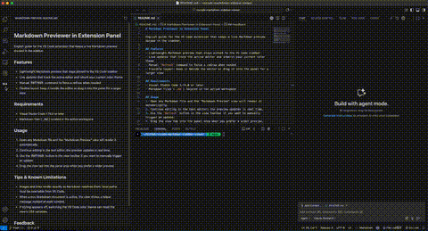

# Markdown Previewer in Extension Panel

Display markdown preview in extension panel.

## Features
- Lightweight Markdown preview that stays pinned to the VS Code sidebar or panel
- Live updates that track the active editor and inherit your current color theme
- Pin/Unpin button to freeze the preview on the file you care about while you browse others
- Context-aware `Edit` button that reopens the previewed file when you're focused on a different document
- Manual `Refresh` command to force a redraw when needed
- Flexible layout: keep it beside the editor or drag it into the panel for a larger view

## Requirements
- Visual Studio Code 1.74.0 or later
- Markdown files (`.md`) located in the active workspace

## Usage
1. Open any Markdown file and the "Markdown Preview" view will render it automatically.
2. Continue editing in the text editor; the preview updates in real time.
3. Use the pin button to lock the preview to the current Markdown file while you switch editors; click again to resume following the active document.
4. When the previewed file differs from the editor you're viewing, click `Edit` in the toolbar to jump straight back to that Markdown file.
5. Use the `Refresh` button in the view toolbar if you want to manually trigger an update.
6. Drag the view tab into the panel area when you prefer a wider preview.

## Tips & Known Limitations
- Images and links render exactly as Markdown resolves them; local paths must be reachable from VS Code.
- When a non-Markdown document is active, the view shows a helper message instead of stale content.
- If styling appears off, switching the VS Code color theme can reset the view’s CSS variables.

## Feedback
Please report bugs or request features via GitHub Issues. Screenshots and concise reproduction steps help us respond quickly.
